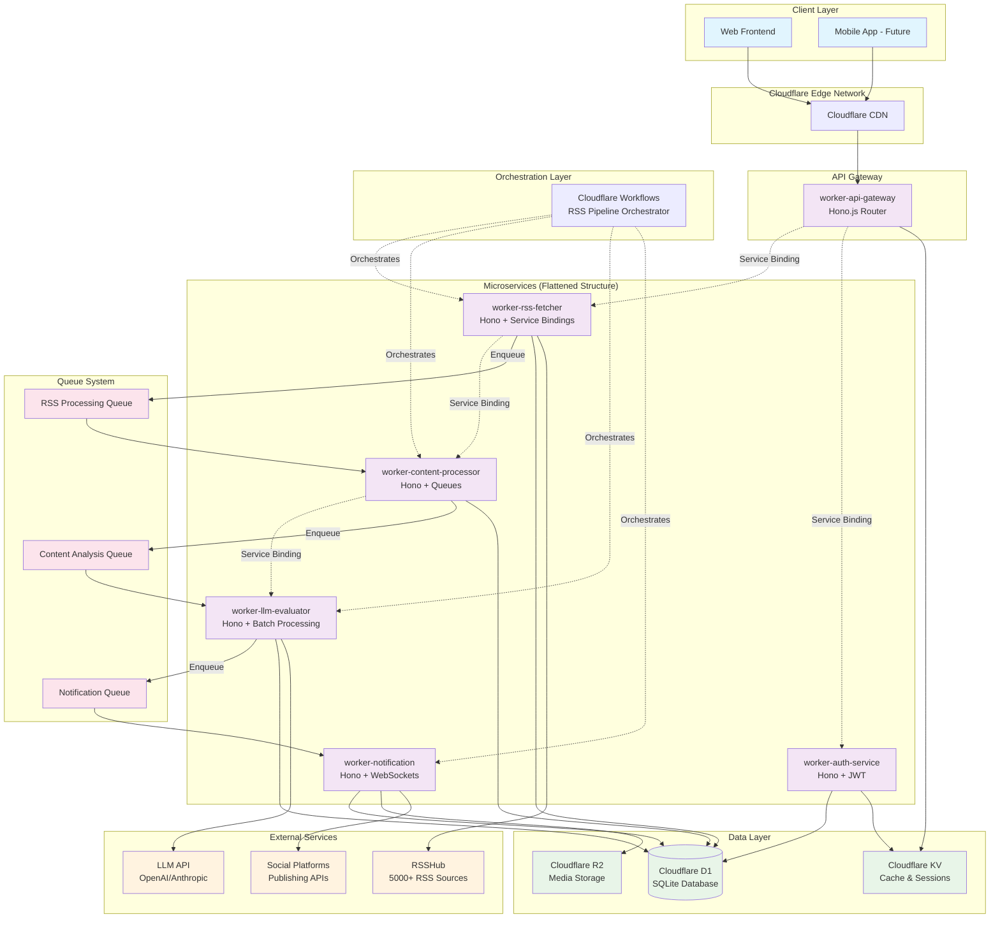

# Cloudflare D1 + Drizzle + Workers + Workflows Architecture Plan v2

## Architecture Overview

This document outlines the refined architecture for the Looplia content generation platform using Cloudflare's serverless ecosystem, leveraging our existing monorepo tooling and `just` CLI commands for streamlined development workflow.

### Key Updates from v1
- **Flattened Worker Structure**: Changed from `apps/workers/*` to `apps/worker-*` for simplified management
- **Just CLI Integration**: Full integration with existing `just` commands for scaffolding and maintenance
- **Automated Tooling**: Leverages Turbo generators and pnpm workspace automation
- **Simplified Deployment**: Consistent naming patterns for easier orchestration

### Architecture Diagram



## Refined Monorepo Structure

### Flattened Worker Architecture

```
looplia/
├── apps/
│   ├── worker-api-gateway/        # Central API router (Hono.js)
│   ├── worker-rss-fetcher/        # RSS polling service (Hono.js)
│   ├── worker-content-processor/  # Content normalization (Hono.js)
│   ├── worker-llm-evaluator/     # AI content scoring (Hono.js)
│   ├── worker-notification/       # User notifications (Hono.js + WebSocket)
│   ├── worker-auth-service/       # Authentication service (Hono.js + JWT)
│   ├── web/                       # Web Frontend with D1 integration
│   └── example-worker-echoback/   # Existing example worker
├── packages/
│   ├── database/                  # Shared Drizzle schemas + D1 client
│   ├── hono-helpers/             # Shared Hono.js utilities and middleware
│   ├── shared/                   # Common types/utils/constants
│   ├── rsshub-client/           # RSSHub integration library
│   └── queue-types/             # Queue message type definitions
└── infrastructure/
    ├── d1-setup/                # Database setup and migration scripts
    └── deployment/              # Deployment scripts and CI/CD workflows
```

### Benefits of Flattened Structure

1. **Simplified Tooling**: No nested directories to manage in Turbo configurations
2. **Consistent Naming**: All workers follow `worker-*` pattern for easy identification
3. **Better Glob Patterns**: Simpler patterns like `apps/worker-*` instead of `apps/workers/*`
4. **Easier Navigation**: All apps at same directory level
5. **Deployment Clarity**: Clear distinction between workers and other app types

## Just CLI Integration

### Core Development Workflow

Our monorepo leverages the `just` command runner for streamlined development workflows:

#### Infrastructure Management
```bash
# Install all dependencies with high concurrency
just install

# Start all development servers
just dev

# Build all applications
just build

# Deploy all workers
just deploy
```

#### Quality Assurance
```bash
# Run comprehensive quality checks (lint, types, format, deps)
just check

# Automatically fix issues
just fix

# Update dependencies across workspace with version consistency
just update-deps
```

#### Scaffolding Commands
```bash
# Create new worker with automatic setup
just new-worker <worker-name>
# Example: just new-worker api-gateway
# Creates: apps/worker-api-gateway/

# Create new shared package
just new-package <package-name>
# Example: just new-package database
# Creates: packages/database/

# Create changesets for versioning
just cs
```

### Generator Configuration Updates

The Turbo generator has been updated to support the flattened `worker-*` structure:

```typescript
// turbo/generators/config.ts - Updated destination path
const destination = `apps/worker-${slugifyText(answers.name)}`
```

This change enables:
- `just new-worker api-gateway` → `apps/worker-api-gateway/`
- `just new-worker rss-fetcher` → `apps/worker-rss-fetcher/`
- Consistent naming across all microservices

## Implementation Phases with Just CLI

### Phase 1: Foundation Setup

```bash
# 1. Update generator configuration for worker-* naming
# Edit: turbo/generators/config.ts (manual update)

# 2. Create database package using existing tooling
just new-package database
# Prompts: "Will this package be used within Cloudflare Workers?" → Yes

# 3. Install Drizzle dependencies
pnpm -F @repo/database add drizzle-orm
pnpm -F @repo/database add -D drizzle-kit @types/better-sqlite3

# 4. Run quality checks
just check
```

### Phase 2: Microservice Scaffolding

```bash
# Create all microservices using generator
just new-worker api-gateway
just new-worker rss-fetcher
just new-worker content-processor
just new-worker llm-evaluator
just new-worker notification
just new-worker auth-service

# Verify structure
ls apps/worker-*
```

### Phase 3: Dependency Installation

```bash
# Database-specific dependencies
pnpm -F @repo/database add @cloudflare/d1

# Worker-specific dependencies
pnpm -F worker-api-gateway add @hono/zod-validator
pnpm -F worker-rss-fetcher add node-cron
pnpm -F worker-content-processor add cheerio
pnpm -F worker-llm-evaluator add openai
pnpm -F worker-notification add ws

# Ensure version consistency
just update-deps

# Run quality checks and fixes
just fix
```

### Phase 4: Development and Testing

```bash
# Start all development servers
just dev

# Run tests
just test

# Build all workers
just build

# Deploy to staging/production
just deploy
```

## Automated Package Management

### Dependency Installation Strategy

Our monorepo uses `pnpm` with workspace protocols for optimal dependency management:

```bash
# Install dependency in specific worker
pnpm -F worker-<name> add <dependency>

# Install dev dependency in specific package
pnpm -F @repo/<package> add -D <dependency>

# Install dependency across multiple workspaces
pnpm -F "worker-*" add <shared-dependency>
```

### Version Consistency with Syncpack

The `just update-deps` command uses `syncpack` to ensure dependency versions are consistent across the monorepo:

```bash
# Check for version mismatches
syncpack list-mismatches

# Fix version inconsistencies
syncpack fix-mismatches

# Update all dependencies
syncpack update
```

## Shared Database Package

### Database Schema Architecture

```typescript
// packages/database/src/schema/users.ts
export const users = sqliteTable('users', {
  id: text('id').primaryKey(),
  email: text('email').notNull().unique(),
  preferences: text('preferences', { mode: 'json' }),
  quotaUsed: integer('quota_used').default(0),
  createdAt: integer('created_at', { mode: 'timestamp' }).default(sql`(unixepoch())`),
})

// packages/database/src/schema/rss.ts
export const rssSubscriptions = sqliteTable('rss_subscriptions', {
  id: text('id').primaryKey(),
  userId: text('user_id').references(() => users.id),
  rsshubRoute: text('rsshub_route').notNull(),
  filters: text('filters', { mode: 'json' }),
  active: integer('active', { mode: 'boolean' }).default(true),
  createdAt: integer('created_at', { mode: 'timestamp' }).default(sql`(unixepoch())`),
})

// packages/database/src/schema/content.ts
export const contentItems = sqliteTable('content_items', {
  id: text('id').primaryKey(),
  url: text('url').notNull(),
  title: text('title').notNull(),
  excerpt: text('excerpt'),
  source: text('source').notNull(),
  rsshubRoute: text('rsshub_route').notNull(),
  aiContentScore: real('ai_content_score'),
  fetchedAt: integer('fetched_at', { mode: 'timestamp' }).notNull(),
  processedAt: integer('processed_at', { mode: 'timestamp' }),
})
```

### Database Client Configuration

```typescript
// packages/database/src/client.ts
import { drizzle } from 'drizzle-orm/d1'
import * as schema from './schema'

export type Database = ReturnType<typeof createDrizzleClient>

export function createDrizzleClient(d1: D1Database) {
  return drizzle(d1, { schema })
}

export * from './schema'
export { sql } from 'drizzle-orm'
```

### Drizzle Configuration

```typescript
// packages/database/drizzle.config.ts
import type { Config } from 'drizzle-kit'

export default {
  schema: './src/schema/*',
  out: './migrations',
  driver: 'd1-http',
  dbCredentials: {
    accountId: process.env.CLOUDFLARE_ACCOUNT_ID!,
    databaseId: process.env.CLOUDFLARE_D1_DATABASE_ID!,
    token: process.env.CLOUDFLARE_API_TOKEN!,
  },
} satisfies Config
```

## Microservice Implementation Patterns

### Worker Template Structure

Each worker created with `just new-worker <name>` follows this structure:

```
apps/worker-<name>/
├── src/
│   ├── index.ts          # Main Hono app
│   ├── context.ts        # TypeScript bindings
│   └── test/
│       └── integration/
│           └── api.test.ts
├── wrangler.jsonc        # Cloudflare Worker config
├── package.json          # Dependencies
├── tsconfig.json         # TypeScript config
├── eslint.config.ts      # ESLint config
└── vitest.config.ts      # Test config
```

### Example Worker Implementation

```typescript
// apps/worker-api-gateway/src/index.ts
import { Hono } from 'hono'
import { cors } from 'hono/cors'
import { jwt } from 'hono/jwt'
import { createDrizzleClient } from '@repo/database'

import type { App } from './context'

const app = new Hono<App>()
  .use('*', cors())
  .use('/api/protected/*', jwt({ secret: 'your-secret' }))

app.route('/api/auth', authRouter)
app.route('/api/rss', rssRouter)
app.route('/api/content', contentRouter)

export default app
```

### Service Binding Configuration

```json
// apps/worker-api-gateway/wrangler.jsonc
{
  "name": "worker-api-gateway",
  "main": "src/index.ts",
  "compatibility_date": "2024-04-01",
  "services": [
    {
      "binding": "AUTH_SERVICE",
      "service": "worker-auth-service"
    },
    {
      "binding": "RSS_SERVICE", 
      "service": "worker-rss-fetcher"
    }
  ],
  "d1_databases": [
    {
      "binding": "DATABASE",
      "database_name": "looplia-db",
      "database_id": "your-database-id"
    }
  ]
}
```

## Development Workflow Integration

### Daily Development Cycle

```bash
# Morning setup
just install          # Ensure all dependencies are current
just check            # Verify codebase health

# Development
just dev              # Start all services in development mode
# Make changes...
just test             # Run tests during development

# Before committing
just fix              # Auto-fix linting and formatting issues
just check            # Final quality verification
just build            # Verify everything builds correctly
```

### Deployment Workflow

```bash
# Pre-deployment verification
just build            # Build all workers
just test             # Run full test suite
just check            # Final quality checks

# Deployment
just deploy           # Deploy all workers to Cloudflare

# Post-deployment
# Monitor logs and metrics via Cloudflare dashboard
```

### Continuous Integration Integration

The `just` commands integrate seamlessly with CI/CD workflows:

```yaml
# .github/workflows/ci.yml
- name: Install dependencies
  run: just install

- name: Run quality checks
  run: just check

- name: Build applications
  run: just build

- name: Deploy to production
  run: just deploy
  if: github.ref == 'refs/heads/main'
```

## Advantages of This Approach

### Developer Experience
- **Single Command Interface**: All operations accessible via `just` commands
- **Automated Scaffolding**: Consistent worker and package creation
- **Quality Assurance**: Built-in linting, type checking, and formatting
- **Fast Parallel Operations**: High-concurrency dependency installation

### Monorepo Benefits
- **Consistent Tooling**: Shared ESLint, TypeScript, and build configurations
- **Version Synchronization**: Syncpack ensures dependency consistency
- **Shared Code**: Database schemas, utilities, and types across all workers
- **Coordinated Deployment**: Turbo orchestrates builds and deployments

### Cloudflare Integration
- **Service Bindings**: Zero-latency inter-service communication
- **Queue Processing**: Efficient batch processing with Cloudflare Queues
- **Workflow Orchestration**: Durable execution with Cloudflare Workflows
- **Edge Deployment**: Global distribution with Cloudflare's edge network

This refined architecture leverages our existing monorepo infrastructure while providing a clear path to implement the RSS-powered content generation platform with modern development practices and automated tooling.